# GIT操作演示

👇下面是对git常用命令的总结和操作截图，全部截图均是本人操作：

#### 1.初始化仓库

- git init命令可初始化仓库

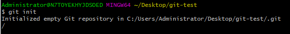

#### 2.添加到暂存区

- 先创建一个文件readme.txt，并添加内容11111111

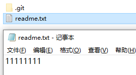

- 用命令 git add . 将当前目录所有所有文件添加到暂存区中

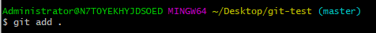

#### 3.提交到本地仓库

- 用 git commit命令提交到本地仓库，-m参数是提交信息

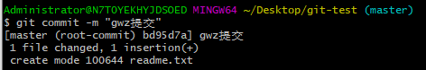

#### 4.查看仓库状态

- 命令git status查看是否还有未提交的文件

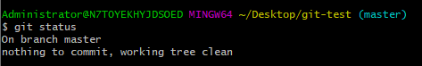

#### 5.查看文件修改了哪些内容

- 在文件readme.txt下面增加一行2222222222内容


- 用git status查看提交结果，可以看到修改了readme.txt且未提交

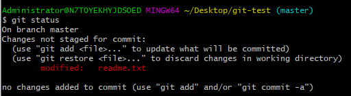

- 用命令git diff .可以查看到底具体修改了哪里

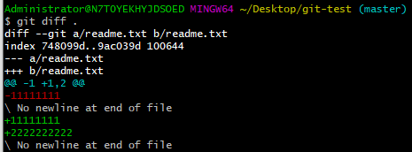

- 知道修改了哪里之后提交到仓库即可

#### 6.版本回退

- 想要版本回退可以先查看历史记录，使用命令git log

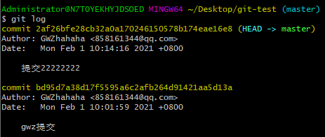

- 如果嫌上面显示的信息太多的话，我们可以使用命令 git log --oneline得到更简洁的历史记录

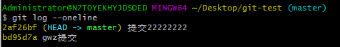

- 回退上一个版本的命令是git reset --hard HEAD^， 那么如果要回退到上上个版本只需把HEAD^ 改成 HEAD^^ 以此类推。那如果要回退到前100个版本的话，可以使用下面的简便命令操作：git reset --hard HEAD~100 即可

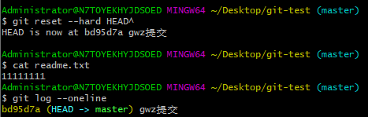

- 上面通过git log可以看到已经回退到上一个版本，然后可以通过版本号又返回到最新的版本；先通过命令git reflog查看全部提交记录的版本号，再用git reset --hard 版本号 来恢复到最新的版本

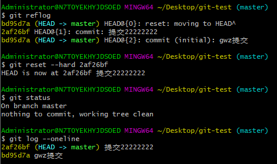

#### 7.工作区与暂存区的区别

- 工作区：就是你在电脑上看到的目录，比如目录下testgit里的文件(.git隐藏目录版本库除外)。或者以后需要再新建的目录文件等等都属于工作区范畴。
- 版本库(Repository)：工作区有一个隐藏目录.git,这个不属于工作区，这是版本库。其中版本库里面存了很多东西，其中最重要的就是stage(暂存区)，还有Git为我们自动创建了第一个分支master,以及指向master的一个指针HEAD。

使用Git提交文件到版本库有两步：

- 是使用 git add 把文件添加进去，实际上就是把文件添加到暂存区。

- 使用git commit提交更改，实际上就是把暂存区的所有内容提交到当前分支上。

#### 8.撤销修改

- 在readme.txt下添加内容3333333333

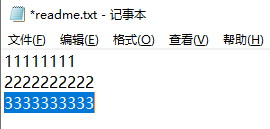

- 现在发现内容错误，想撤回修改，可以用下面两种方法
  1. 如果我知道要删掉那些内容的话，直接手动更改去掉那些需要的文件，然后add添加到暂存区，最后commit掉。
  2. 我可以按以前的方法直接恢复到上一个版本。使用 git reset --hard HEAD^

- 但不用上面两种方法也可以，先用git status查看状态

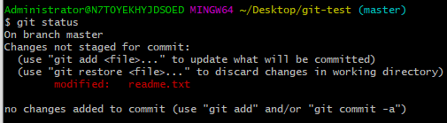

- 然后使用命令git checkout .可以丢弃工作区的修改，可以看到git status恢复正常，readme内容也撤销了修改

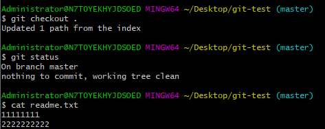

- git checkout .撤回修改也有两种情况，如下：
  1. readme.txt自动修改后，还没有放到暂存区，使用 撤销修改就回到和版本库一模一样的状态。
  2. 另外一种是readme.txt已经放入暂存区了，接着又作了修改，撤销修改就回到添加暂存区后的状态

#### 9.删除文件

- 在目录下新建一个b.txt文件然后可以提交到仓库，如果要删除这个文件，可以手动删除或者用命令 rm 文件名 然后再commit提交到仓库就可以完成修改
- 但是只要在commit前都可以用git checkout . 撤销修改来恢复删除的文件


#### 10.远程仓库

不同的人修改同一个文件的同一个地方会报错冲突，解决的办法也很简单，上面已经提示我们，先用git pull把最新的提交抓下来，然后在本地合并，解决冲突，再推送。【如果git pull也失败了，那么一般是没有指定当前分支与远程仓库分支的链接，使用命令 git branch --set-upstream 当前分支 origin/远程分支 即可解决】

- 要将本地内容推送到远程仓库，先执行命令 git remote add 仓库地址 

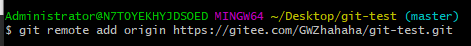

- 我们第一次推送master分支时，加上了 –u参数，Git不但会把本地的master分支内容推送的远程新的master分支，还会把本地的master分支和远程的master分支关联起来，在以后的推送或者拉取时就可以简化命令

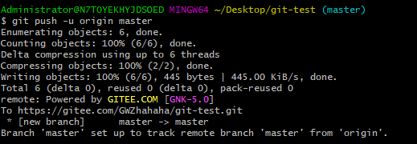

- 码云上的仓库如下，已经成功推送：

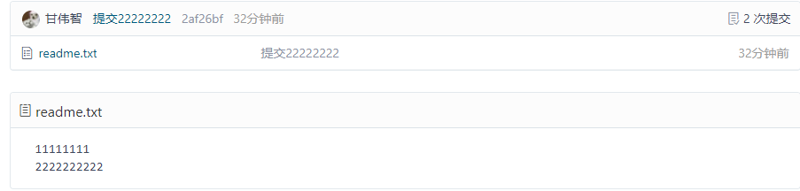


- 远程仓库的多人协作工作模式一般是这样的：
  - 首先，可以试图用git push origin 远程分支名 推送自己的修改.
  - 如果推送失败，则因为远程分支比你的本地更新早，需要先用git pull试图合并。
  - 如果合并有冲突，则需要解决冲突，并在本地提交。再用git push origin 远程分支名 推送。

#### 11.克隆仓库

- 直接用命令 git clone 仓库名 即可，十分简单
- 当你从远程库克隆时候，实际上Git自动把本地的master分支和远程的master分支对应起来了，并且远程库的默认名称是origin。
  - 要查看远程库的信息 使用 git remote
  - 要查看远程库的详细信息 使用 git remote –v


#### 12.创建与合并分支

每次提交Git都把提交记录串成一条时间线，这条时间线就是一个分支。截止到目前只有一条时间线，在Git里这个分支叫主分支，即master分支。HEAD严格来说不是指向提交而是指向master，master才是指向提交的，所以HEAD指向的就是当前分支。

- 使用命令 git checkout -b 分支名 代表创建分支并且切换分支，相当于如下2条命令
  1. git branch dev
  2. git checkout dev

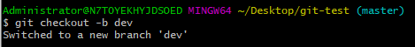

- 然后在dev分支上的readme.txt添加内容“dev”并commit，然后切回主分支master，会发现在dev分支上添加的内容不见了

  1. dev分支上的readme添加内容dev，并且提交

     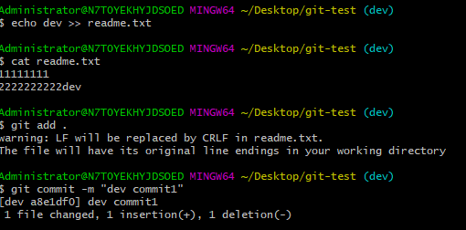

  2. 切换会主分支master后发现添加的内容不见了

     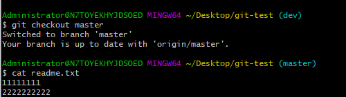

- 然后现在将dev分支上的内容合并到master分支上，使用命令 

  git merge 分支名 即可合并，这次合并是“快进模式”，也就是直接将master指向dev的当前提交，所以合并速度非常快。

  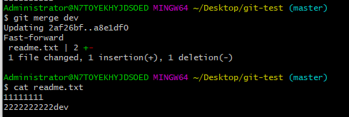

- 合并完可以删除分支，使用命令 git branch -d 分支名 即可删除

  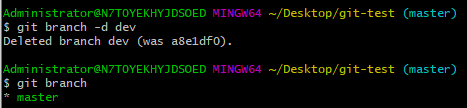 

- 总结创建与合并分支命令如下：

  ```
  查看分支：git branch
  创建分支：git branch name
  切换分支：git checkout name
  创建+切换分支：git checkout –b name
  合并某分支到当前分支：git merge name
  删除分支：git branch –d name
  ```

#### 13.解决冲突

- 先新建一个新分支dev，在readme.txt添加一行内容9999999999，然后提交

  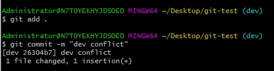

- 然后切换会主分支master，也在最后一行添加内容8888888888，然后提交

  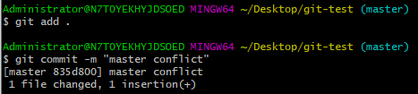

- 然后与分支dev进行合并git merge dev，发生冲突了

  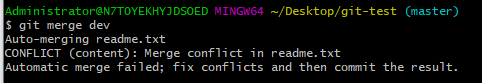

- 用git status查看状态情况看看是哪里发生冲突了

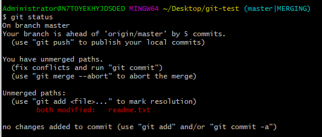

- 发现是readme.txt文件冲突了，然后cat readme.txt查看该文件具体情况；Git用<<<<<<<，=======，>>>>>>>标记出不同分支的内容，其中<<<HEAD是指主分支修改的内容，>>>>>dev 是指dev上修改的内容

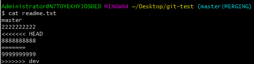

- 此时我们手动修改将冲突那行内容改为master-dev然后提交，此时冲突解决了

  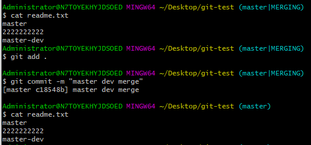

- 如果要查看分支合并情况可以使用git log查看

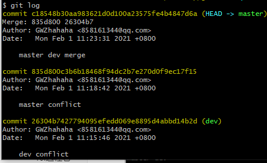

#### 14.分支管理策略

- 通常合并分支时，git一般使用”Fast forward”模式，在这种模式下，删除分支后，会丢掉分支信息，使用带参数 –no-ff可以禁用”Fast forward”模式【git merge –no-ff -m “注释” dev】
- 首先master主分支应该是非常稳定的，也就是用来发布新版本，一般情况下不允许在上面干活，干活一般情况下在新建的dev分支上干活，干完后，比如上要发布，或者说dev分支代码稳定后可以合并到主分支master上来。

#### 15.暂存区管理

这里使用一个bug分支做例子。每个bug都可以通过一个临时分支来修复，修复完成后，合并分支，然后将临时的bug分支删除掉。比如我在开发中接到一个404 bug时候，我们可以创建一个404分支来修复它，但是当前的dev分支上的工作还没有提交。

- 此时在dev分支上正在进行操作，操作到一半还没提交，此时要进行另一个bug分支的操作，那么可以用git stash将当前分支所修改的内容先隐藏起来

  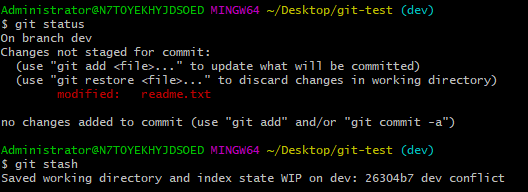

- 此时可以创建bug分支来修改bug

  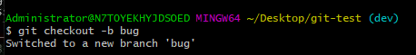

- bug修复完成提交后切回dev分支，并且将bug分支删除

  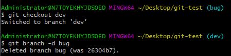

- 此时工作区是干净的，使用命令 git stash list 查看暂存区的内容

  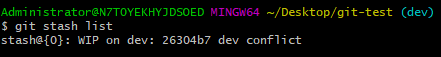

- 接下来从暂存区恢复之前dev分支中正在修改且未提交的内容即可，可以使用如下2个方法：

  1. git stash apply恢复，恢复后，stash内容并不删除，你需要使用命令git stash drop来删除。
  2. 另一种方式是使用git stash pop,恢复的同时把stash内容也删除了。

  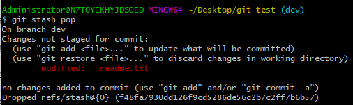

  


