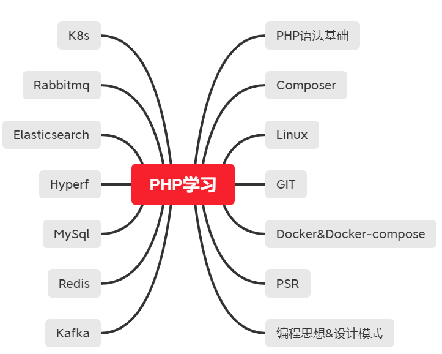

## 图示如下

## 完成情况

+ [x] Composer
+ [x] Docker&Docker-compose
+ [x] Elasticsearch[尚未全部完成]
+ [ ] FAQ
+ [x] Git
+ [x] Hyperf[现在排版格式不太好]
+ [ ] Kafka
+ [x] Linux[尚未全部完成]
+ [ ] Mysql
+ [ ] Nginx
+ [x] PHP基础
+ [x] Rabbitmq
+ [x] Redis
+ [ ] kubernate
+ [x] 设计模式
+ [x] 业务流程[尚未全部完成，里面是对业务理解的笔记]

## 资料链接

资料pdf太大了，传不上来，晚点贴上gitbook链接

