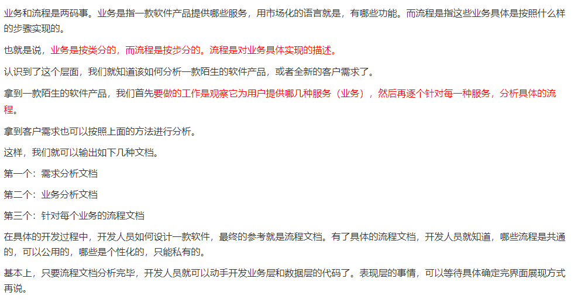
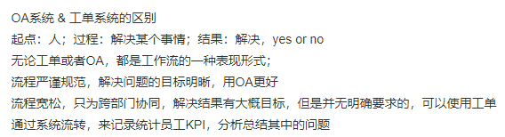
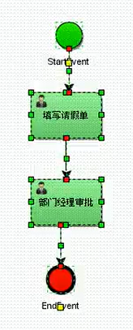
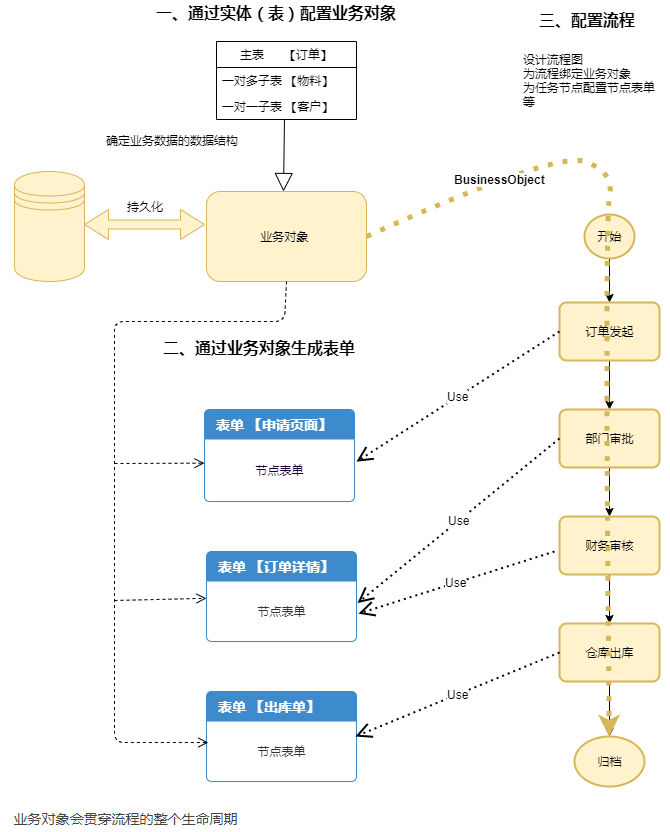
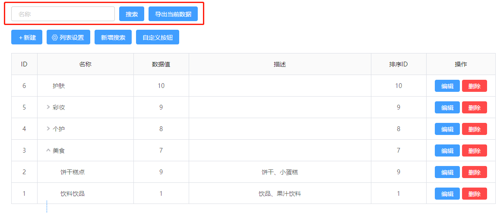
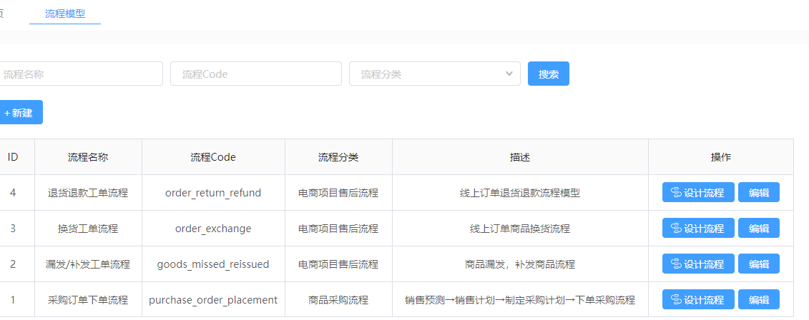
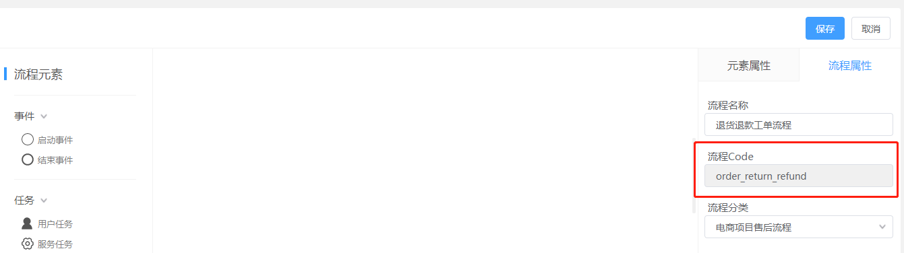

### 业务流程

下面写的是关于对工作流引擎和流程的笔记，尚未整理完成，现在排版还不太好看，都是我的随时写下的理解和想法，基本上都是一个个字打出来的:

wiki上的自定义流程部如下👇：

##### 1.流程部署表deployments是用来保存文字内容和图片那些资源，是资源表

##### 2.流程定义表procedure_definitions类似于类，流程实例表procedure_instances就像是它生产的对象（实例表有外键关联定义表）

##### 3.流程实例表procedure_instances有个外键关联流程定义表

##### 4.流程任务表run_tasks，流程在运行过程中所产生的任务数据保存在run_task表中。有两个外键，一个关联流程定义表，一个关联流程实例表

##### 5.流程参数表run_variables，存放流程中的参数，这类参数包括流程实例参数、执行流参数和任务参数，参数有可能会有多种类型，因此该表使用多个字段来存放参数值。有个外键关联流程实例表

##### 6.流程与身份关系表run_identity_links，用户或者用户组与流程数据之间的关系，使用run_identity_link来保存。有个两个外键，一个关联流程实例表，一个关联流程定义表。

##### 7.事件描述表events，如果流程到达某类事件节点，BPMN会往event表中加入事件描述数据，这些事件描述数据将会决定流程事件的触发。有个两个外键，一个关联流程实例表，一个关联流程定义表。

##### 业务是描述一个逻辑功能，流程是用流程语言描述的业务实现的具体动作。

**业务对象用来承载、持久化业务数据；表单则是业务数据的展示层；流程则用来驱动业务数据流转。**

👇

- 这种⚪的是事件(Event)，有开始事件和结束事件；中间方的是任务(Task)；全部合起来就是一个流程，整张图(bpmn)也就是流程定义

- 流程图bpmn（即流程定义）本质上是xml文件

- 流程定义部署，实际上是将流程定义里面的数据部署到activity的三张数据库表里面去。要把流程定义部署进流程部署表之后才能产生流程实例

- HI表代表是历史表

  - HI表中名字是pro开头代表的是流程表

  - HI表中名字是act开头代表的是活动表hi_actinst【即Event+Task合并的表】，当完成complete了一个任务实例的时候，这个表就会多出下一个需要完成的任务实例【但此时END_TIME_是NULL，因为尚未complete】;**任务联系人表hi_identitylink**也会出现下一条记录。

  - 流程实例可以反过来查询到流程定义，但查不了流程部署；流程定义可以查到流程部署

  - 任务(Task)要完成complete之后才算结束，**历史任务实例表hi_taskinst**对应的任务实例才会出现END_TIME_的值，然后此时**历史任务实例表hi_taskinst**会出现下一个需要执行的任务实例；但如果不complete那就是NULL且表不会出现下一条任务。

- RU表都是正在运行的表

  - ru_task是当前正在运行任务的表，当前任务完成即被complete后，就会把当前任务记录删除，然后插入下一个任务的数据。如果全部已经执行完了那就整个表为空了
  - ru_excution是记录了流程中所有运行过【包括正在运行的】的任务，当整个流程结束后【即达到了结束事件】整个表就会清空；同理ru_identitylink也是一样。
  - 总结：当整个流程结束后，ru_task，ru_excution和ru_identitylink都空了
  - 业务主键ru_business在ru_execution表中

- GE表是通用资源文件
  - ge_bytearray表是放bpmn文件和png文件数据记录的，两个一起放。
  - ge_property表是记录引擎信息，这个表一般不会改变

#### 核心概念汇总：

1. 工作流：工作流就是指定好标准的一套流程
2. 业务流：业务流比工作流更加详细，它里面的每个任务都制定了解决问题的逻辑，工作流是业务流重要的一部分。
3. 业务单据：定义为执行核心业务流程的节点或业务逻辑处理程序。数据结构是主、从表结构，既一张主表对应多个明细表，也有一些业务单据只有主表，如：《应收帐款》、《应付帐款》、《采购单》、《销售单》、《出入仓单》等类型视为【业务单据】。
4. 业务数据：业务数据是指业务单据的数据。如：《应收帐款》、《应付帐款》、《采购单》、《销售单》、《出入仓单》等单据的数据
5. 数据字典：就是将数据库中常变的数据另外分出来一张表，使得系统维护性提高
6. 流程：任务和事件全部合起来就是一套流程
7. 事件：开始事件和结束事件
8. 任务：除了事件以外的节点
9. 自动流转任务：就是指会自动完成的任务，比如请假一小时系统会自动通过
10. 用印：用印就是加盖发文单位公章。
11. 工单系统和OA系统：工单系统和OA系统有些类似，但工单系统主要对外客户使用，而OA系统主要对内员工使用【可以看作是客户提出问题后，客服人员通过工单系统将这个问题反馈整成一个工单，然后对这个工单的解决过程进行流程化【跟踪，记录，处理，或者转给不同部门来解决处理】，完成之后通知给客户】

    - 工单系统：一般情况下主要是指用于工作任务的记录、处理、跟踪完成情况的软件系统。而工单也就是可以看作一个待处理的流程，这个系统就是用来跟踪这个流程的，同时可以根据不同企业组织的需求增加分类来对工单种类进行细分，从而有针对的分配合适的任务给合适的管理人员进行处理工单问题

    - 不管是OA还是工单系统，本质还是工作流；你得看一下员工的自觉性，属于自发性的用协同软件，看板工具就够用了；如果属于半驱动的员工，用 工单；如果属于绵羊被动驱赶的员工，用OA。【不仅可人工分派，还可通过渠道来源、服务目录、预设工作流、忙闲状态智能分配到对的人或组；工单串联所有部门，谁的活谁去处理，最后协同统一输出，以工单为线索，让每一个请求都得到响应，每一个问题都可追踪】
    - 总结👉：

工单处理流程过程一般步骤如下：

1. 发起任务指派申请
2. 相关负责人进行审核
3. 对任务进行分配并设置好各个处理节点的负责人，该负责人会在数据流转到该节点时收到**待办通知**。
4. 流程中可以设置合适的抄送节点，把当前工单的处理状态发送给客服人员或者管理者，提醒他们当前数据的状态。
5. 工单处理完毕之后可以电子归档，方便日后查询追溯。

补图：

#### 注意事项：

##### 1.生成自定义表单前要自己填写表单key，然后用户任务要绑定该key；生成自定义表单时会自动生成表单访问地址url，流程实例ID，部署ID，唯一任务表单ID【因为自定义表单很多个，基本一个任务就对应一个自定义表单】；表单提交后数据存储在run_varibles运行参数表当中，然后将任务ID传递给下一个任务；下一个任务的自定义表单就能根据传递过来的上一个任务ID来查询它的表单数据【这种是表单数据流转】。

##### 2.标签定义文件中的userTask和serviceTask或者httpTask里面的那些标签参数是不一样的。

##### 3.每个标签定义文件里面的标签参数都是不一样的，根据使用场景来选择即可

##### 4.在低代码平台看不懂或者听不懂的业务，基本上只能参考其他开源的bpmn工作流引擎，参考市面上常用的工作流引擎对业务有很大帮助。

##### 5.要理解与业务流的关系，一般是要靠看代码和流程图才能理解。

#### 业务与流程结合的例子图【**业务对象用来承载、持久化业务数据；表单则是业务数据的展示层；流程则用来驱动业务数据流转。**三者共同协作完成流程实施。】

### 产品原型笔记

自定义表单最后生成的表单【里面是文本框，选择按钮那些】是为了让客户填写然后增加数据到默认生成的数据列表中；自定义Table是根据自己填写的数据源那些来配置数据列表，主要用来展示数据用的。【有个提示，自定义表单和自定义table生成出来的数据列表是有点差异的】

1.自定义表单可以认为是表单，而自定义Table则是数据列表，表单Code可以认为是表单的唯一ID，填写了表单Code之后页面地址会自动生成，页面地址对应表单的数据列表（Table）页面地址【自定义Table也有，且Table的code不能与表单的code重复】

2.自定义表单的“操作”里面有“数据列表”的按钮，点击后就能进入数据列表即【自定义Table】表单生成模板

3.自定义表单可以通过自定义每个组件的内容来生成对应的组件，自定义表单里面设置的所有文本框，按钮等组件都是为了添加数据到数据列表中

***

4.数据列表也可以自定义设置操作，但更多的是只能提那就按钮来进行搜索

5.在自定义table中配置数据源时可以配置多个关联表的URL。

6.自定义table中的“到处当前数据”的按钮不出现在“自定义按钮”列表中。

7.一个按钮是否显示出来就看这个按钮的操作权限是否和用户的匹配，如果用户拥有这个按钮的多个操作权限的其中一种，则按钮会显示出来。

8.除了自定义按钮以外还能自定义搜索【自定义了按钮之后就能新增“操作”那一列，自定义“搜索”之后就能改变搜索那一行的UI】

***

9.工单类型也能自定义从而适应不同的环境，它能自定义是因为关联了表单Code。在“工单配置”新建生成了一个**工单类型**，在“工单管理”中可以管理诸多工单记录的数据列表【table】

***

10.系统配置的菜单设置是用来设置左边的路由链接的，增加一个菜单就能动态生成左边一个路由链接

11.字典数据里面有两种数据，静态和动态，静态的直接写入数据库表然后需要使用时拿出来即可；动态数据的话因为常常需要变动数据比如增加或者修改，所以动态数据是关联表中的某个字段。

数据字典主要是用于下拉框和选择框那些固定有限的情景使用。

***

12.业务流程也是类似于上面的设计，通过新建一个流程，自行填写流程Code，不可与其他流程的Code重复、

13.流程中的用户任务会有“关联表单Code”的一项，因为每个用户任务一般都是要有一个表单要处理，当表单处理完之后就会使对应的数据列表Table增加记录数据。

14.在流程里面，子流程也算是一个节点任务，因此它除了有节点Code以外还要有子流程的流程Code

15.在流程中流向箭头也算是个节点，有自己的节点Code

16.流程实例已结束就是全部完成了，已终止就是运行到一半流程被终止了。

***

17.keewood中的审批功能，设置审批人时，右上角有取消按钮的是自选模板，没有的话的是默认模板或者是指定模板【不可更改或者添加成员】；自选模板中，一排人最多4个，超过4个会自动将选择的剩下的人跳到下一行。

18.keewood中有审批模板可以自定义设置，设置完之后可以模板可以用于发起审批。

***

#### 上面的全部总结：

1.<u>**表单中心**</u>是自定义表单的地方，新建一种表单就能多一种表单类型记录，然后可以通过这个表单记录的“设计表单”按钮跳到**<u>设计表单</u>**页面进行自定义表单【就是拖动那些组件来形成一个表单】；表单最重要的是表单Code，后面很多记录都会关联这个表单Code，来给用户填写这个表单。

2.<u>**设计表单**</u>里面有些组件可以关联**数据字典**的Code，比如多选框，下拉框等

3.**<u>数据列表</u>**是自定义数据列表的地方，新建一种数据列表就能多一条数据列表类型，然后通过“配置数据源”按钮来获取数据；数据列表也有唯一的Code

4.进入了**<u>具体的数据列表</u>**里面可以通过“列表设置”的按钮来定义列表风格【比如改成默认列表还是多级列表，是否显示导出数据，分页和筛选字段等信息】，还能通过“自定义按钮”按钮来设置自己想要的按钮出现在列表的“操作”列上【可以设置图标，权限，类型等很多数据】，还能通过“新增搜索”按钮来设置增加想要的搜索条件【当配置了任意一项自定义搜索时，”搜索“按钮自动显示。“导出当前数据”按钮开启且页面配置了搜索条件时，和“搜索”按钮一同显示 】

5.其实数据列表这一部分抽象的挺好，就是一个数据列表里面的每条数据代表一种类型，然后这个类型又可以通过“查看”按钮进入该类型下的所有具体数据，这里面其实又是一个数据列表【就像是**<u>工单类型</u>**和**<u>工单管理</u>**的关系一样，但**<u>工单管理</u>**里面的数据所属类型是混乱的】

6.**<u>工单配置</u>**的每条类型数据里面是关联了表单Code，意思就是需要创建某种类型的工单时都需要填写这个Code对应的表单来新建工单类型，然后可以在**<u>工单管理</u>**里面发起工单或者查看工单处理情况；工单完结了之后按钮和大框框都会消失。

7.**<u>菜单设置</u>**可以通过表单填写来新建左边的菜单路径。

***

8.<u>**流程模型**</u>中可以通过表单填写信息【包括流程Code和流程分类的字典数据】来新建一个流程类型，然后可以在“操作”那一列中点击“设计流程”按钮跳到**<u>设计流程</u>**页面

9.**<u>设计流程</u>**通过工作流引擎来新建流程定义【这个实际是bpmn的改版】，这个流程定义通过流程Code绑定着**<u>流程模型</u>**中的某个类型，流程中的每个节点【即包括事件和任务和网关】都有独自的节点Code【不可重复】，而子流程有子流程Code和节点Code

10.**<u>流程实例</u>**是由流程模型创建出来的多个实例，每个实例都会有流程Code绑定它对应的流程模型，点击“操作”那一列的“实例明细”按钮可以跳到**<u>实例明细</u>**页面查看里面的信息流转记录，看看该实例进行到哪一个任务。

***

11.<u>**设计流程**</u>中的**审批任务**会有一个地方关联表单Code，是为了给审批的人填写的；还有新增的**流程进度**组件是可以查看流程中每个节点的完成情况

12.**<u>审批模板配置</u>**是用来定义新建审批模板的网页，模板中可以定义多个审批人和抄送人【这里每个都称为一个节点，每个节点都可以设置为自选模板或是指定模板，即每个节点又是一个小模版】，即可以理解一个审批模板由多个节点组成，最后以模板Code为准。

13.待我处理的审批和我发起的审批是不一样的。

- 我发起的审批是选择通过指定模板或者自选模板来选择审批人和抄送人。
- 待我处理的审批有评论，转交，同意和拒绝四个选择

14.**<u>审批管理</u>**中的“已发起的”分类中的“操作”列会根据不同情况出现不同的按钮

***

### 物料开发原型笔记：

1. 物料开发有三个主要模块：新品开发流程，普及流程，供应商入驻流程。
2. 首先在**<u>新品需求</u>**页面里面通过“新建物料新品需求”按钮填写对应的表单【物料项目名称就在这里生成】，生成审批任务给部门来审批【审批场景页面基本和keewood的审批一样的】
3. 然后在**<u>新增组件</u>**页面里面通过“+新增组件”按钮来添加一条条新的组件记录，会生成组件Code。
4. **<u>新增物料和设计图</u>**中可以在一个物料项目中添加多个物料，而一个物料可以添加多个组件。通过“提交并继续添加”按钮可以提交当前表单的数据然后跳到新的一样表单页继续填写表单。
5. 然后把新增的物料发起审批【审批过程和keewood的一样】
6. **<u>拆图供应商</u>**页面中是将新品设计图拆分给供应商即可
7. **<u>新品深化图</u>**页面是让供应商提供深化图，物料清单，数量等；供应商提交了深化图之后物料开发对其进行审批。【审批过程和keewood的差不多】
8. **<u>新品父子级绑定</u>**页面是将物料【父】和组件【子】进行绑定的地方，这个页面的列表里面每一条数据都是用来查看该物料对应的多个组件的父子级绑定关系。
9. **<u>选择报价供应商</u>**页面里面主要是物料开发部来选择不同的供应商来给物料报价
10. **<u>需求报价单</u>**页面里面是是由供应商填写对应的表单然后发起审批给物料开发部审批物料开发部选择完供应商之后就轮到供应商操作了，**<u>需求报价单</u>**页面的列表数据是由供应商已经填写完成的对应的报价表单，然后由物料开发发起审批，发起审批之后的审批流程基本和keewood的一致。
11. **<u>新品建档信息</u>**页面的数据列表是编辑和发起新品建档表单的地方，然后发起审批之后审批的流程基本和keewood的一样。
12. **<u>样品下单</u>**页面【物料开发部的角度】是由物料开发选择发货的供应商让他们发货到对应的门店，点击“编辑”，“查看”按钮可以打开**“物料样品下单”表单**；点击“发货供应商”按钮可以打开**“发货供应商”表单**；点击“样品验收报告”按钮会跳到**<u>样品验收报告</u>**页面，点击“样品发货信息”按钮会跳到**<u>样品发货信息</u>**页面
13. 提交了“样品下单”之后，然后物料开发部，设计部，需求部，在**<u>样品验收报告</u>**页面中填写各自对应的验收报告表单。
14. **<u>供应商订单详情</u>**页面【物料开发部的角度】中点击“需求明细表”按钮就跳到**<u>需求明细表</u>**页面，点击“发货详情”按钮就跳到**<u>样品发货信息</u>**页面【这部分有些不太懂，先标个记】

***

##### 普及流程

1. **<u>普及审批</u>**页面中通过点击“+新增普及审批”按钮来填写“普及审批”表单，提交审批之后审批流程和keewood的基本一样。
2. **<u>确认父子级关系</u>**页面中通过点击“查看”按钮，“编辑”按钮，“更新父子级”按钮打开“选择报价供应商”表单

***

##### 供应商入驻流程

1. **<u>创建供应商</u>**页面可以有表单可以

